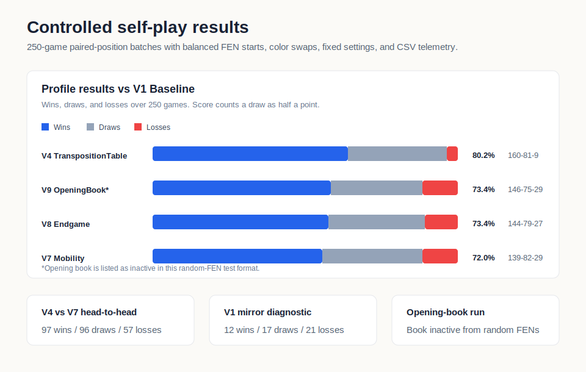
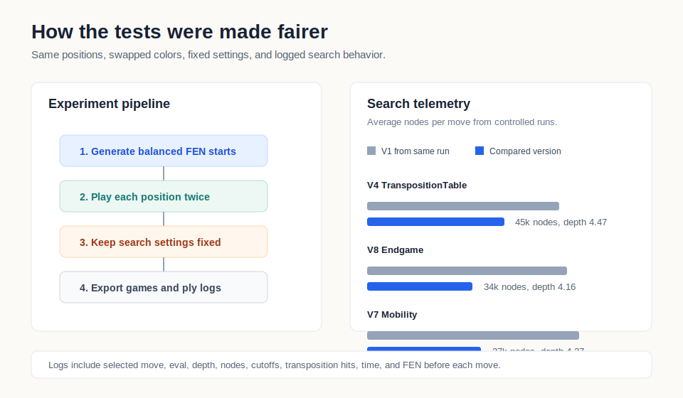

# poorfish

*Poorfish* is a Unity/C# chess engine I built to study how search and evaluation changes affect gameplay.

It started as a playable chess project, but it expanded into an experimental system. The engine can play AI vs AI matches, log what it searched, and compare different versions under controlled conditions. The main lesson so far has been that making an engine stronger is not just about adding features. It is also about designing tests that show whether a change actually helped.

## Play

[Play poorfish on itch.io](https://lywoo.itch.io/poorfish)

---

## What I Built

Core pieces:

- legal move generation and rule validation
- minimax search with alpha-beta pruning
- iterative deepening, move ordering, and transposition table caching
- configurable engine profiles for testing search and evaluation changes
- AI vs AI match runner with CSV and PGN output
- per-ply telemetry for moves, evaluations, depth, nodes, cutoffs, time, and FEN

## Experiment Design

Although my first AI-vs-AI tests were flawed, giving a version of the engine an unfair advantage because of the side it played, the position it started from, or mismatched engine settings, it pushed me to treat the match runner as part of the engineering problem. 

My improved control test environment uses:

- balanced random FEN starting positions 
- paired games where each position is played with colors swapped
- fixed batch settings
- consistent CSV, PGN, and ply-level logs
- engine profiles so techniques can be compared cleanly

## Results

Most of the current evidence comes from 250-game paired-position runs against `V1_Baseline`:

| Test | Result |
| --- | --- |
| `V4_TranspositionTable` vs `V1_Baseline` | 160 wins, 81 draws, 9 losses |
| `V7_Mobility` vs `V1_Baseline` | 139 wins, 82 draws, 29 losses |
| `V8_Endgame` vs `V1_Baseline` | 144 wins, 79 draws, 27 losses |
| `V9_OpeningBook` vs `V1_Baseline` | 146 wins, 75 draws, 29 losses |

`V4_TranspositionTable` had the strongest result against the baseline. Later evaluation-focused versions still won clearly, but their gains were smaller in this test set.

I also tested stronger versions against each other. `V4_TranspositionTable` scored 97 wins, 96 draws, and 57 losses against `V7_Mobility`, which made me question whether extra evaluation terms were helping enough to justify the added complexity.

One early 50-game `V1_Baseline` mirror test ended 12 wins for one side, 21 for the other, and 17 draws. Since both engines were identical, that result showed me that the experiment setup itself could affect the result.

The `V9_OpeningBook` result is included with context: these tests start from random FEN positions, so the opening book usually does not trigger. I treat that run as another profile comparison, not proof that the book improved play.

## What I Learned

The biggest lesson so far is that deeper search is not automatically better chess. When the evaluation function was weak, searching deeper often led to repetition instead of progress.

That shifted my focus from simply adding features to testing whether each change measurably improved play. The match runner, logs, profiles, and starting positions became just as important as the engine changes themselves.

## Current Focus

*Poorfish* is still being developed. Current goals:

- reduce repetition and safe-loop behavior
- improve evaluation pressure in winning positions
- run cleaner ablation tests
- expand analysis tools for match logs
- refine the WebGL build and player experience
