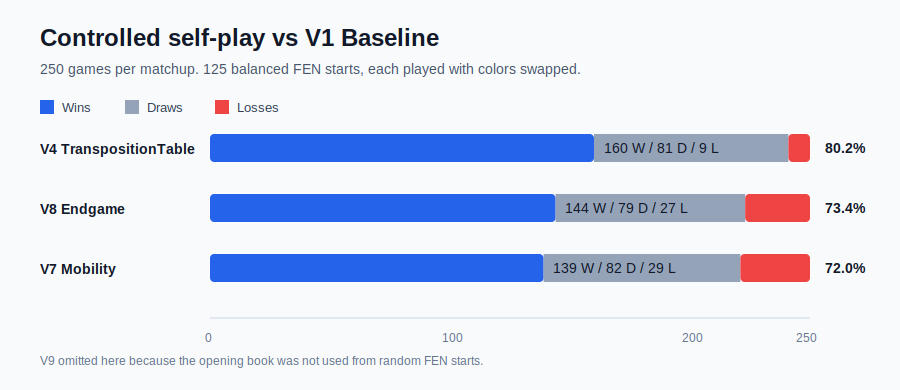
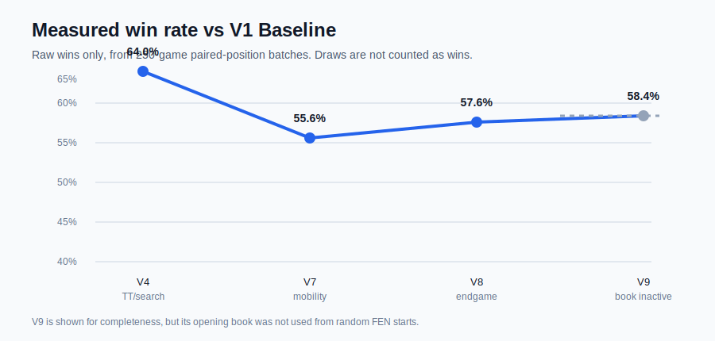
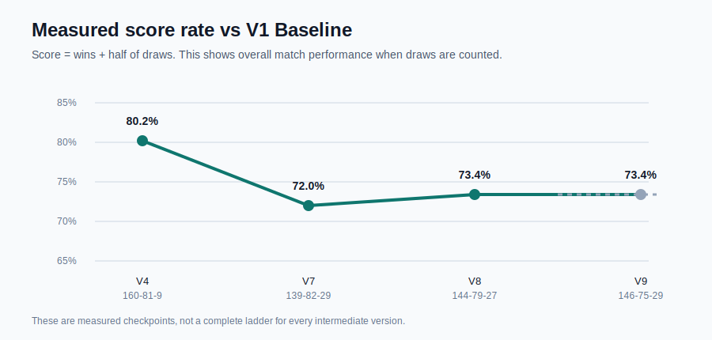
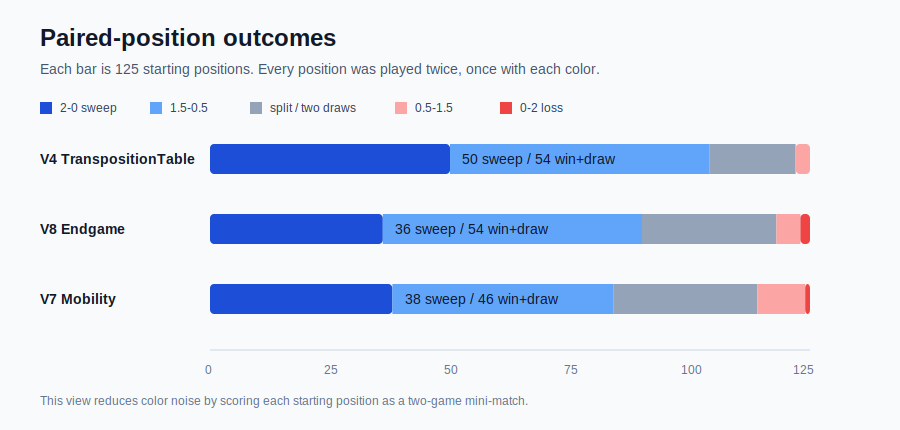
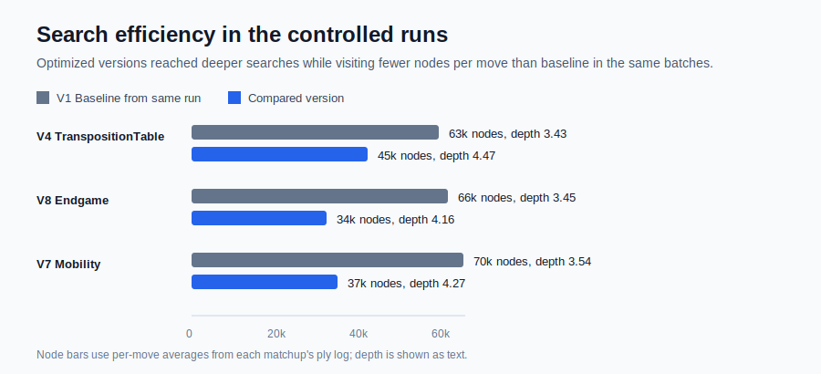
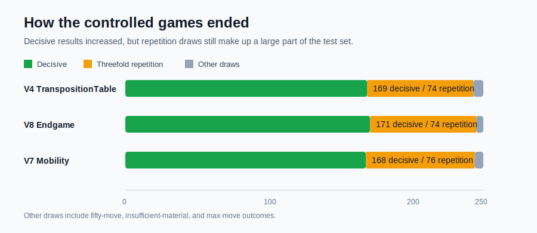

# poorfish

`poorfish` is a Unity/C# chess engine and experimentation system focused on understanding how search algorithms and evaluation functions affect decision-making.

It started from a Unity chess foundation, but I’ve been extending it into a system I can analyze rather than just play.

## Play it

[Play poorfish on itch.io](https://lywoo.itch.io/poorfish)

---

## Overview

The project supports a full chess game loop with legal move generation, special rules (castling, en passant, promotion), and complete game-state handling.

More importantly, it is structured to allow fast simulation and experimentation on chess positions rather than relying on Unity scene objects.

---

## Architecture

The system separates game logic from rendering:

- `BoardState` represents the position as a 64-square array
- Move generation and rule validation operate entirely on this model
- Search runs independently of Unity objects
- Unity handles visualization and interaction

This separation allows the engine to simulate positions quickly and run AI search and experiments without scene overhead.

---

## Chess AI

The engine uses a search-based approach:

- Minimax with alpha-beta pruning
- Iterative deepening and time-limited search
- Transposition table caching
- Move ordering and adaptive endgame depth

The evaluation function goes beyond material:

- Piece-square tables
- Mobility and positional heuristics
- King pressure and endgame features
- Configurable weights through engine profiles

To better understand behavior, I added instrumentation:

- nodes explored  
- alpha-beta cutoffs  
- transposition hits  
- search depth and time  

This lets me measure how the engine works instead of treating it as a black box.

---

## Experimentation

I built an AI-vs-AI batch system with CSV logging so I could compare engine configurations across full games.

Logged data includes:

- FEN positions  
- evaluation scores  
- search depth  
- nodes explored  
- pruning cutoffs  
- transposition hits  

Current controlled tests use balanced random FEN positions, color-swapped pairs, and per-ply search telemetry.

In the latest 250-game comparisons, the search-focused `V4_TranspositionTable` profile scored 160 wins, 81 draws, and 9 losses against `V1_Baseline`. Later evaluation-heavy versions also beat the baseline, but not as strongly in this test set.

The opening-book profile is not included in the chart because these experiments start from random positions, where the book did not trigger. That makes opening-book strength a separate experiment from the balanced-FEN tests.

The high draw count still matters: many games end by repetition, which suggests the engine often prefers safe loops over converting advantages. My next focus is improving evaluation pressure and progress incentives rather than only adding more features.

---

## Key Insight

One of the main insights from this project is that deeper search does not necessarily lead to better play.

In many cases, increasing depth without improving evaluation caused the engine to repeat moves or fail to make progress.

This shifted my focus from adding features to understanding how search and evaluation interact, and treating the engine as something to measure and test rather than something to complete.

---

## Status

`poorfish` is still in progress. Current focus areas:

- reducing repetition in endgames  
- strengthening evaluation heuristics  
- comparing engine profiles through self-play  
- improving analysis tooling for logged data  
- refining the WebGL build  
